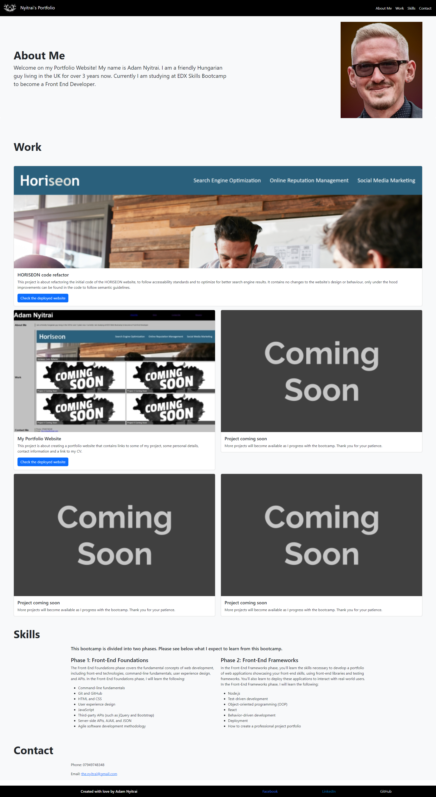

# Adam Nyitrai Bootstrap Portfolio

## Description
This project is about recreating the portfolio website I created previously, this time by using Bootstrap to complete the project. The website contains a short introduction of myself, some of my previous project with links to the deployed applications, contact information and the list of skills I expect to learn from this bootcamp.

## Screenshot

## Links
[Link to the deployed website](https://nyitrai87.github.io/bootstrap-portfolio/)

## Sources
- For the navbar I have used and modified some codes from the 05-Stu-Custom-Navbar bootcamp material.
- For the Skills section I used the 1.1.2: Roadmap section of the bootcamp prework.
- For the "Coming Soon" placeholder I used the [https://placehold.co/](https://placehold.co/) website.